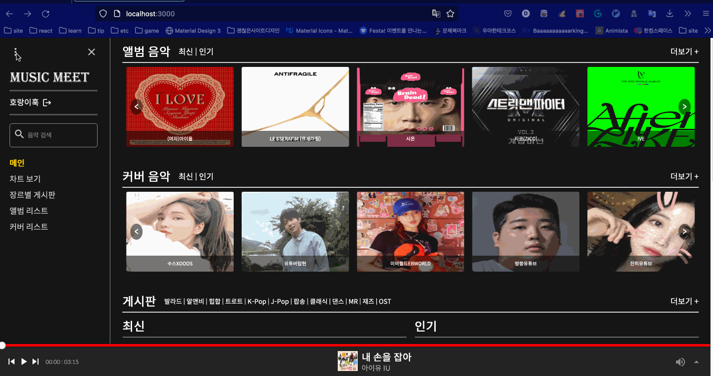
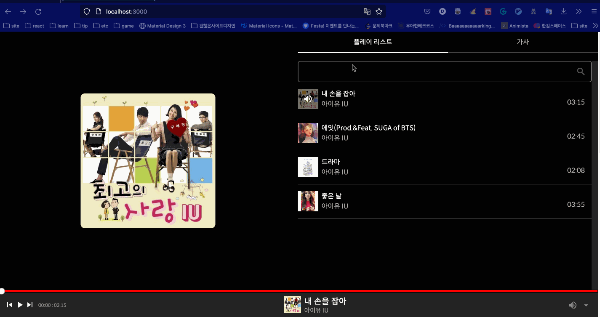
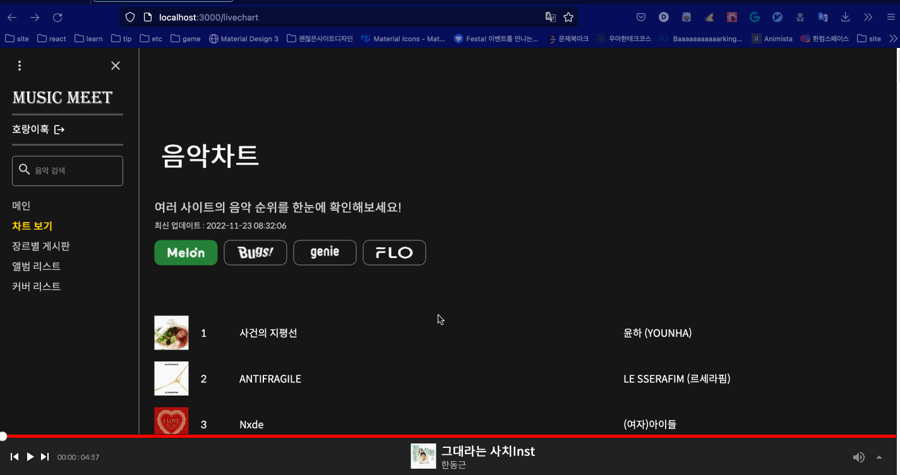
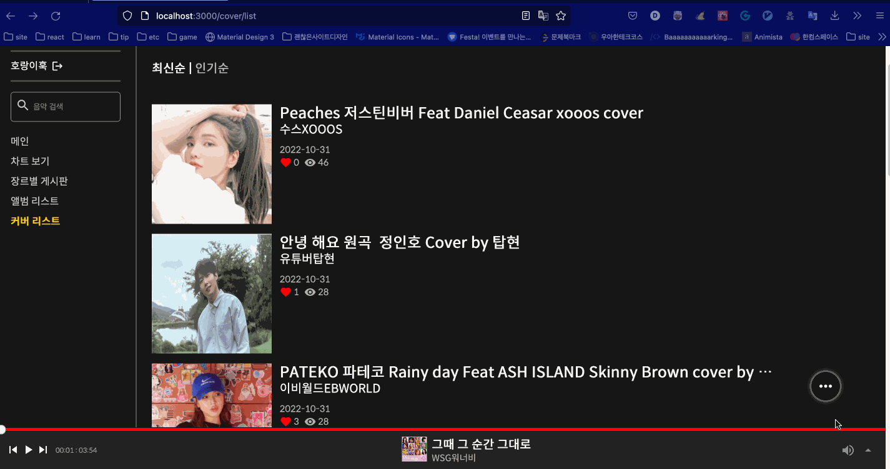
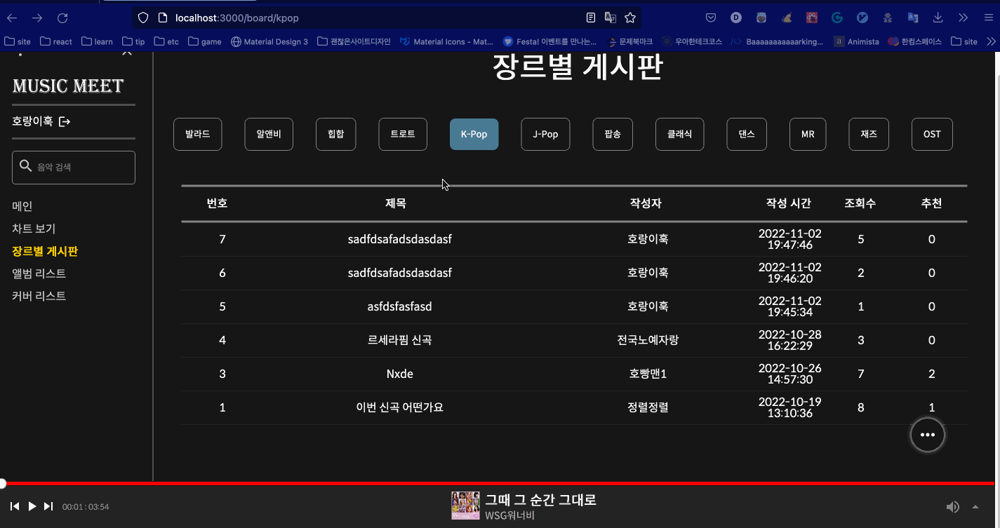

# Music Meet

이 프로젝트는 졸업작품을 위해 제작한 팀 프로젝트입니다.

이 프로젝트의 [ADMIN](https://github.com/MUSIC-MEET/admin) 페이지입니다.

## 소개

Music Meet은 음악을 좋아하는 사람들을 대상으로 만든 사이트입니다.

기능으로는 플레이 리스트, 타 음원 사이트의 실시간 순위, 장르별 게시판, 유저 커버 업로드 등이 있습니다.

부가적으로 유저의 편의를 위해 다크모드를 지원하며 해외 유저를 유입시키기 위해 다국어 모드를 지원합니다.

## 팀원
| 이름 | 역할 |
|------|---|
| [김윤석](https://github.com/ycs-202007055)| 팀장, 백앤드 개발|
|[이유태](https://github.com/dobidugi)| 프론트엔드 개발|
|[김민성](https://github.com/ycs-201607083)| 안드로이드 개발|
|[김정렬](https://github.com/kimjungryul)| QA |
|[임지원](#)| 자료조사 |
## 사용 기술

### Backend

Java11, Spring Boot, MySql, JSoup, REST-API, JWT, lombok

### Frontend

React, TypeScript, react-query, msw, emotion, i18next, Axios, recoil, Toast/Editor

### Android

Kotlin, Retrofit2

### SCM

GitHub, Notion (https://dobidugi.notion.site/MUSIC_MEET-bdb3df5bf78641a8870d946b371ce7ac)

### etc

Postman, ERDCloud (https://www.erdcloud.com/d/csnqvMvSeFevxJy8q)

## 실행방법

### Backend 실행 방법

DB 세팅

```bash
mysql -u root -p
0000
```

```bash
create database music_meet
use music_meet
source Backend/music_meet/sql/initsql.sql
```

빌드

```bash
cd Backend/music_meet/
./gradlew build
```

실행

```bash
java -jar Backend/music_meet/build/libs/music_meet-0.0.1-SNAPSHOT.jar
```

### 프론트 실행 방법

```bash
cd Frontend/
npm install --legacy-peer-deps && npm start
```

### 화면 



다크모드 및 다국어 지원




플레이 리스트 지원




타 사이트 실시간 차트 지원




유저 커버 지원 




각종 커뮤니티 기능 지원
